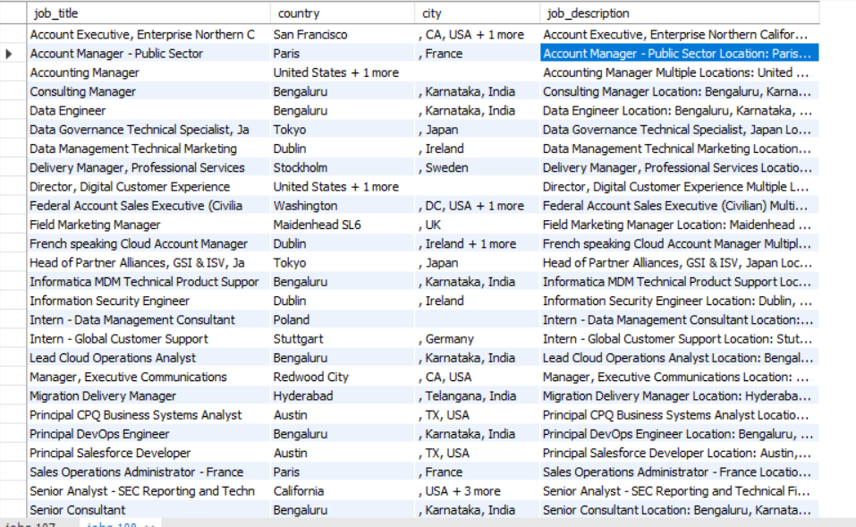

# Scraping-Data 

> Extracting the jobs from the following site --> https://informatica.gr8people.com/jobs?utm_medium=Direct
* Saving every job in json file and extract some fields: job title, Country, city,  job description 

* I used the following libraries: requests , BeautifulSoup   , mysql.connector ,os, json

## **1. Table example**

  

    

> NOTE: ALL RIGHTS RESERVED TO SHIR FELDMAN 

